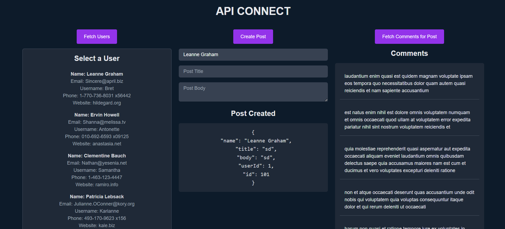

# React + Vite

This template provides a minimal setup to get React working in Vite with HMR and some ESLint rules.

Currently, two official plugins are available:

- [@vitejs/plugin-react](https://github.com/vitejs/vite-plugin-react/blob/main/packages/plugin-react/README.md) uses [Babel](https://babeljs.io/) for Fast Refresh
- [@vitejs/plugin-react-swc](https://github.com/vitejs/vite-plugin-react-swc) uses [SWC](https://swc.rs/) for Fast Refresh

# API Connect

 <!-- Replace with the path to your project image -->

## Overview

The **API Connect** is a React application that allows users to fetch data from multiple APIs, create posts, and retrieve comments related to those posts. The application is built using Vite, React, and Tailwind CSS, providing a responsive and user-friendly interface.

## Features

- **Fetch Users**: Retrieve and display user data from an API.
- **Create Posts**: Create a post associated with a selected user.
- **Fetch Comments**: Retrieve comments related to the created post.
- **Responsive Design**: The application is responsive, adjusting to different screen sizes.
- **Loading Indicators**: Visual feedback for loading states.

## Usage

- **Fetch Users**: Click the "Fetch Users" button to retrieve user data.
- **Create Posts**: Select a user and fill in the post title and body, then click the "Create Post" button.
- **Fetch Comments**: After creating a post, click the "Fetch Comments for Post" button to retrieve comments.

## Technologies Used

- **React**: A JavaScript library for building user interfaces.
- **Vite**: A fast build tool for modern web development.
- **Tailwind CSS**: A utility-first CSS framework for styling.
- **Axios**: For making HTTP requests.

## Installation

### Prerequisites

Make sure you have [Node.js](https://nodejs.org/) installed on your machine.

### Clone the repository

```bash
git clone https://github.com/Sachinnegi825/ApiConnect.git
cd api-connect
```
